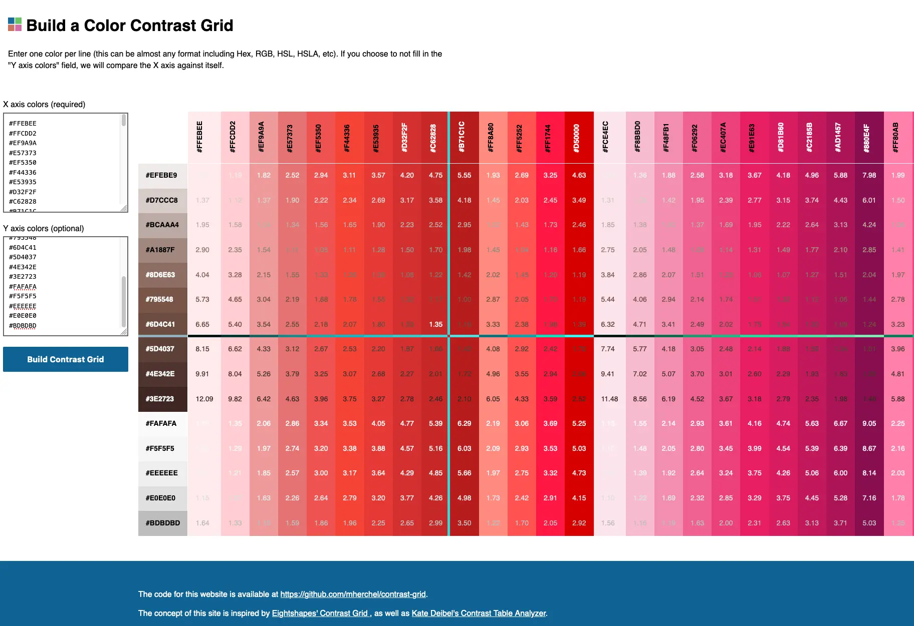

# Contrast Grid Tool

This repository is the codebase for [ContrastGrid.com](https://contrastgrid.com/).

## About

This online tool takes one or more lists of colors (in most common formats) and generates a grid matrix showing the colors’ contrast ratio against each other.

This is useful when evaluating color systems, and which colors can be used together while still remaining accessible (per [WCAG 2.1 1.4.3 Minimum Contrast Success Criterion](https://www.w3.org/WAI/WCAG21/Understanding/contrast-minimum.html).

## Features

I had a lot of fun adding some really cool features into this:

- Extremely lightweight. Built with vanilla JavaScript and CSS.
- Saves the input colors to the URL, so the link can be shared or bookmarked.
- Ability to ingest lots of color formats such as hex, HSL, etc. We use the [TinyColor library](https://github.com/bgrins/TinyColor), which accepts formats such as hex, HSL, named, HSV, etc. [See here for more info](https://github.com/bgrins/TinyColor#accepted-string-input).
- Ability to specify different sets of colors on the X and Y axes.
- “Crosshair” effect when hovering mouse over grid cell helps the user visually navigate to its respective color table headings.
- Table headings (both column and row) will become “sticky” and stay in the viewport. This is useful when evaluating very large color systems which requires both horizontal and vertical scrolling.

## Inspiration

The concept of this site is inspired by [Eightshapes' Contrast Grid](https://contrast-grid.eightshapes.com/), as well as [Kate Deibel's Contrast Table Analyzer](https://metageeky.github.io/contrast_table_analyzer/contrast-table.html). Both of these tools are excellent, but didn’t provide exactly what I was looking for.
